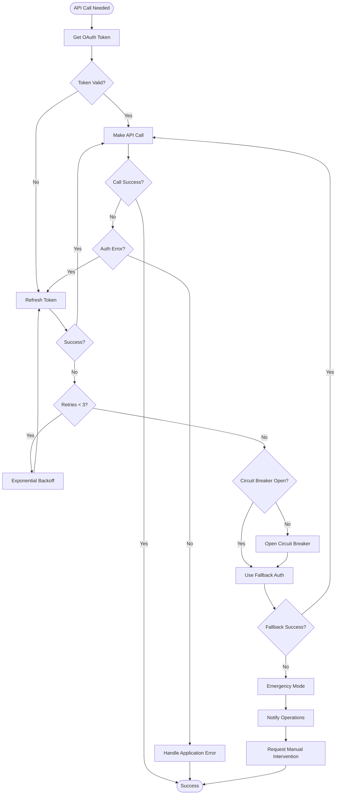

# OAuth Error Handling and Recovery Strategy

## Overview
Comprehensive error handling for OAuth token failures during long-running Modal functions.

## Error Scenarios and Mitigations

### 1. Token Expiration During Execution

**Scenario**: A Modal function starts with valid token but it expires during a 30+ minute execution.

**Solution**:
```python
class LongRunningTaskHandler:
    def __init__(self, token_manager: OAuthTokenManager):
        self.token_manager = token_manager
        self.last_refresh = datetime.utcnow()
        self.refresh_interval = timedelta(minutes=15)  # Proactive refresh
        
    async def execute_with_token_management(self, task_func, *args, **kwargs):
        """Wrapper for long-running tasks with proactive token refresh"""
        
        # Create a background token refresher
        refresh_task = asyncio.create_task(self._background_token_refresh())
        
        try:
            # Execute the main task
            result = await task_func(*args, **kwargs)
            return result
            
        finally:
            # Cancel the refresh task
            refresh_task.cancel()
            try:
                await refresh_task
            except asyncio.CancelledError:
                pass
    
    async def _background_token_refresh(self):
        """Proactively refresh tokens during long operations"""
        while True:
            await asyncio.sleep(self.refresh_interval.total_seconds())
            
            try:
                # Check if we should refresh
                time_since_refresh = datetime.utcnow() - self.last_refresh
                if time_since_refresh > self.refresh_interval:
                    await self.token_manager.get_valid_token()  # Forces refresh if needed
                    self.last_refresh = datetime.utcnow()
                    logger.info("Proactive token refresh completed")
            except Exception as e:
                logger.error(f"Background token refresh failed: {e}")
                # Don't crash the background task, continue trying
```

### 2. Network Failures During Token Refresh

**Scenario**: Network issues prevent token refresh, potentially causing cascading failures.

**Solution**:
```python
class NetworkResilientTokenManager(OAuthTokenManager):
    async def _refresh_token_with_network_resilience(self):
        """Enhanced refresh with network failure handling"""
        
        # Try multiple endpoints if available
        endpoints = [
            oauth_config["token_endpoint"],
            oauth_config.get("backup_token_endpoint"),
            "https://api.anthropic.com/oauth/token"  # Fallback
        ]
        
        last_error = None
        for endpoint in endpoints:
            if not endpoint:
                continue
                
            try:
                # Use different timeout strategies
                for timeout_config in [
                    httpx.Timeout(5.0, connect=2.0),   # Quick attempt
                    httpx.Timeout(15.0, connect=5.0),  # Standard attempt
                    httpx.Timeout(30.0, connect=10.0)  # Patient attempt
                ]:
                    try:
                        return await self._attempt_refresh(endpoint, timeout_config)
                    except httpx.TimeoutException:
                        continue
                        
            except Exception as e:
                last_error = e
                logger.warning(f"Failed to refresh token from {endpoint}: {e}")
                
        # All attempts failed
        if last_error:
            raise NetworkTokenRefreshError(f"All endpoints failed: {last_error}")
```

### 3. Invalid/Corrupted Tokens

**Scenario**: Token storage corruption or invalid token response from server.

**Solution**:
```python
class ValidatingTokenManager(OAuthTokenManager):
    async def _validate_and_test_token(self, token: str) -> bool:
        """Validate token and test with a simple API call"""
        
        # Structural validation
        try:
            # Check if it's a valid JWT structure
            parts = token.split('.')
            if len(parts) != 3:
                return False
                
            # Decode header and payload (without verification)
            import base64
            import json
            
            header = json.loads(base64.urlsafe_b64decode(parts[0] + '=='))
            payload = json.loads(base64.urlsafe_b64decode(parts[1] + '=='))
            
            # Check expiration
            if 'exp' in payload:
                if payload['exp'] < time.time():
                    return False
                    
        except Exception:
            return False
            
        # Functional validation - test with simple API call
        try:
            test_client = Anthropic(
                http_client=httpx.AsyncClient(
                    headers={"Authorization": f"Bearer {token}"},
                    timeout=5.0
                )
            )
            
            # Minimal API call to verify token works
            await test_client.messages.create(
                model="claude-3-haiku-20240307",  # Cheapest model
                messages=[{"role": "user", "content": "test"}],
                max_tokens=1
            )
            
            return True
            
        except Exception as e:
            logger.error(f"Token validation API call failed: {e}")
            return False
```

### 4. Concurrent Token Refresh

**Scenario**: Multiple Modal functions try to refresh the same token simultaneously.

**Solution**:
```python
class DistributedTokenManager(OAuthTokenManager):
    def __init__(self, redis_client):
        super().__init__()
        self.redis = redis_client
        self.instance_id = str(uuid.uuid4())
        
    async def get_valid_token(self):
        """Get token with distributed locking"""
        
        # Try to get from Redis cache first
        cached_token = await self.redis.get("oauth:token:current")
        if cached_token and self._is_token_valid_str(cached_token):
            return cached_token
            
        # Need to refresh - acquire distributed lock
        lock_key = "oauth:refresh:lock"
        lock_acquired = False
        
        try:
            # Try to acquire lock with timeout
            lock_acquired = await self.redis.set(
                lock_key, 
                self.instance_id,
                nx=True,  # Only if not exists
                ex=30     # 30 second timeout
            )
            
            if lock_acquired:
                # We have the lock, do the refresh
                new_token = await self._refresh_token()
                
                # Store in Redis for other instances
                await self.redis.set(
                    "oauth:token:current",
                    new_token,
                    ex=3600  # 1 hour cache
                )
                
                return new_token
                
            else:
                # Someone else is refreshing, wait and retry
                await asyncio.sleep(2)
                
                # Check if refresh completed
                cached_token = await self.redis.get("oauth:token:current")
                if cached_token and self._is_token_valid_str(cached_token):
                    return cached_token
                    
                # Still no valid token, might be stuck - force refresh
                return await self._force_refresh_with_backoff()
                
        finally:
            # Release lock if we hold it
            if lock_acquired:
                await self.redis.delete(lock_key)
```

### 5. Quota/Rate Limit Errors

**Scenario**: Claude API quota exceeded or rate limits hit.

**Solution**:
```python
class QuotaAwareTokenManager(OAuthTokenManager):
    def __init__(self):
        super().__init__()
        self.quota_tracker = QuotaTracker()
        
    async def handle_api_call_with_quota(self, api_func, *args, **kwargs):
        """Execute API call with quota awareness"""
        
        # Check if we're near quota limits
        quota_status = await self.quota_tracker.check_quota()
        
        if quota_status.usage_percent > 90:
            # Near quota - try to use cached responses
            cache_key = self._generate_cache_key(api_func, args, kwargs)
            cached = await self.get_cached_response(cache_key)
            if cached:
                return cached
                
        if quota_status.usage_percent > 95:
            # Very close to quota - only critical operations
            if not self._is_critical_operation(api_func):
                raise QuotaExceededError(
                    "Non-critical operation blocked due to quota",
                    usage=quota_status
                )
                
        try:
            result = await api_func(*args, **kwargs)
            
            # Cache successful responses
            await self.cache_response(cache_key, result)
            
            return result
            
        except APIError as e:
            if e.status_code == 429:  # Rate limit
                # Implement exponential backoff
                retry_after = int(e.response.headers.get('Retry-After', 60))
                
                # Switch to lower-tier model if available
                if 'model' in kwargs and kwargs['model'] == 'claude-3-opus-20240229':
                    kwargs['model'] = 'claude-3-sonnet-20240229'
                    logger.warning("Downgrading to Sonnet due to rate limit")
                    
                    # Wait and retry with lower model
                    await asyncio.sleep(retry_after)
                    return await self.handle_api_call_with_quota(api_func, *args, **kwargs)
                    
                raise
```

### 6. Complete OAuth System Failure

**Scenario**: Complete OAuth system failure requiring fallback to alternative authentication.

**Solution**:
```python
class FallbackAuthenticationManager:
    def __init__(self):
        self.oauth_manager = OAuthTokenManager()
        self.github_app_manager = GitHubAppTokenManager()
        self.api_key_manager = EmergencyAPIKeyManager()  # Encrypted, time-limited
        
    async def get_authentication_token(self) -> Tuple[str, str]:
        """Get token with multiple fallback options"""
        
        # Try OAuth first
        try:
            token = await self.oauth_manager.get_valid_token()
            return (token, "oauth")
        except Exception as e:
            logger.error(f"OAuth failed: {e}")
            
        # Try GitHub App token (if Claude supports it)
        try:
            token = await self.github_app_manager.get_token_for_claude()
            return (token, "github_app")
        except Exception as e:
            logger.error(f"GitHub App auth failed: {e}")
            
        # Emergency API key (requires manual intervention)
        try:
            # This requires manual approval and is time-limited
            token = await self.api_key_manager.request_emergency_key(
                reason="OAuth and GitHub App auth failed",
                duration_minutes=30,
                requires_approval=True
            )
            
            # Alert operations team
            await alert_operations_team(
                "Emergency API key requested",
                context={"oauth_error": str(e)}
            )
            
            return (token, "emergency_api_key")
            
        except Exception as e:
            logger.critical(f"All authentication methods failed: {e}")
            raise CriticalAuthenticationFailure("Unable to authenticate with Claude")
```

## Error Recovery Workflow



## Monitoring and Alerting

```yaml
alerts:
  - name: oauth_refresh_failure_rate
    condition: rate(oauth_refresh_failures[5m]) > 0.1
    severity: warning
    action: notify_slack
    
  - name: oauth_circuit_breaker_open
    condition: oauth_circuit_breaker_state == "open"
    severity: critical
    action: page_oncall
    
  - name: fallback_auth_usage
    condition: rate(fallback_auth_used[1h]) > 0
    severity: warning
    action: notify_team
    
  - name: token_expiry_during_execution
    condition: rate(token_expired_during_task[1h]) > 0.05
    severity: warning
    action: investigate_long_running_tasks

dashboards:
  - oauth_health:
      panels:
        - token_refresh_success_rate
        - average_token_lifetime
        - refresh_latency_p99
        - fallback_usage_trend
        - circuit_breaker_state
        - concurrent_refresh_conflicts
```