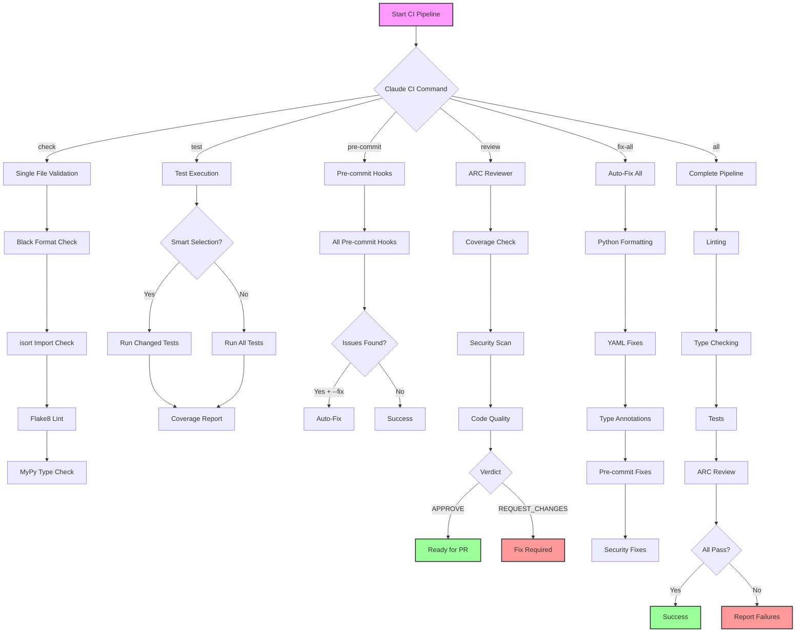

# CI Testing Guide - Comprehensive Local CI Pipeline

This guide provides a complete overview of our local CI testing infrastructure, including the unified `claude-ci` command suite and all testing methodologies.

## 🚀 Quick Start - Unified CI Command

```bash
# Run complete CI validation with auto-fix
./scripts/claude-ci.sh all --auto-fix-all

# Quick validation (seconds)
./scripts/claude-ci.sh all --quick

# Run smart tests only
./scripts/claude-ci.sh test

# Fix everything automatically
./scripts/claude-ci.sh fix-all
```

## 📋 Complete CI Command Reference

### Claude CI - Unified Command Hub

The `claude-ci.sh` script provides a single interface for all CI operations:

| Command | Purpose | Duration | Auto-Fix |
|---------|---------|----------|----------|
| `claude-ci check <file>` | Validate single file | ~1s | ✅ with --fix |
| `claude-ci test` | Smart test selection | 10-30s | ❌ |
| `claude-ci test --all` | Full test suite | 3-5m | ❌ |
| `claude-ci pre-commit` | Pre-commit validation | 30-60s | ✅ with --fix |
| `claude-ci review` | ARC-Reviewer PR check | 15-45s | ❌ |
| `claude-ci fix-all` | Fix all fixable issues | 1-2m | ✅ automatic |
| `claude-ci all` | Complete validation | 3-5m | ✅ with --auto-fix-all |
| `claude-ci all --quick` | Essential checks only | 30s | ✅ with --auto-fix-all |
| `claude-ci all --comprehensive` | Full validation + integration | 10m+ | ✅ with --auto-fix-all |

### Options

- `--fix` - Auto-fix issues where possible
- `--all` - Run all tests (not just smart selection)
- `--create-issues` - Create GitHub issues for unfixable problems
- `--auto-fix-all` - Fix everything possible before failing
- `--quick` - Quick validation mode (essential checks only)
- `--comprehensive` - Full validation including integration tests
- `--pretty` - Human-readable output instead of JSON
- `--verbose` - Show detailed output

## 🔄 CI Pipeline Overview

### Complete Pipeline Flow



## 📊 CI Execution Trace

### Full CI Pipeline Execution

```bash
$ ./scripts/claude-ci.sh all
[2025-07-25 14:23:45] Running comprehensive CI validation
[2025-07-25 14:23:45] Running linting checks...
[2025-07-25 14:23:46] → Executing: pre-commit run --all-files
[2025-07-25 14:23:48] ✓ black.............................Passed
[2025-07-25 14:23:49] ✓ mypy..............................Passed
[2025-07-25 14:23:49] ✓ trim trailing whitespace..........Passed
[2025-07-25 14:23:49] ✓ fix end of files.................Passed
[2025-07-25 14:23:50] ✓ check yaml........................Passed
[2025-07-25 14:23:50] ✓ isort.............................Passed
[2025-07-25 14:23:51] ✓ flake8............................Passed
[2025-07-25 14:23:51] ✓ yamllint..........................Passed
[2025-07-25 14:23:52] ✓ Context YAML Lint.................Passed
[2025-07-25 14:23:52] ✓ Linting checks passed

[2025-07-25 14:23:52] Running type checking...
[2025-07-25 14:23:52] → Executing: mypy src/ tests/
[2025-07-25 14:23:55] ✓ Type checking passed

[2025-07-25 14:23:55] Running tests...
[2025-07-25 14:23:55] → Executing: pytest --cov=src --cov-report=term-missing
[2025-07-25 14:24:35] ✓ 1055 tests collected
[2025-07-25 14:24:35] ✓ 1051 passed, 4 skipped
[2025-07-25 14:24:35] ✓ Coverage: 79.84%
[2025-07-25 14:24:35] ✓ Tests passed

[2025-07-25 14:24:35] Running ARC reviewer...
[2025-07-25 14:24:35] → Executing: python -m src.agents.arc_reviewer --skip-coverage
[2025-07-25 14:24:37] 🔍 Starting ARC-Reviewer analysis...
[2025-07-25 14:24:37] 📁 Analyzing 12 changed files
[2025-07-25 14:24:38] ⚡ Skipping coverage check for faster execution
[2025-07-25 14:24:47] ✓ verdict: APPROVE
[2025-07-25 14:24:47] ✓ summary: All checks passed - ready for merge

[2025-07-25 14:24:47] {
  "status": "PASSED",
  "command": "all",
  "duration": "62s",
  "details": {"status": "clean"},
  "next_action": "Ready for PR"
}
```

### Quick CI Check Execution

```bash
$ ./scripts/claude-ci.sh all --quick
[2025-07-25 14:30:12] Running comprehensive CI validation
[2025-07-25 14:30:12] Running linting checks...
[2025-07-25 14:30:14] ✓ Linting checks passed
[2025-07-25 14:30:14] Running type checking...
[2025-07-25 14:30:16] ✓ Type checking passed
[2025-07-25 14:30:16] Running tests...
[2025-07-25 14:30:16] → Using smart test selection
[2025-07-25 14:30:28] ✓ Tests passed (smart selection: 87 tests)
[2025-07-25 14:30:28] Running ARC reviewer...
[2025-07-25 14:30:40] ✓ ARC reviewer passed
[2025-07-25 14:30:40] {
  "status": "PASSED",
  "command": "all",
  "duration": "28s",
  "details": {"status": "clean"},
  "next_action": "Ready for PR"
}
```

### Fix-All Execution

```bash
$ ./scripts/claude-ci.sh fix-all
[2025-07-25 14:35:22] 🔧 Running comprehensive auto-fix...
[2025-07-25 14:35:22] Fixing Python formatting...
[2025-07-25 14:35:23] → Running: black src/ tests/ scripts/
[2025-07-25 14:35:24] ✓ Formatted 3 files
[2025-07-25 14:35:24] → Running: isort src/ tests/ scripts/
[2025-07-25 14:35:25] ✓ Fixed imports in 2 files

[2025-07-25 14:35:25] Fixing YAML issues...
[2025-07-25 14:35:25] → Checking YAML files for formatting
[2025-07-25 14:35:26] ✓ Fixed line length in sprint-4.1.yaml
[2025-07-25 14:35:26] ✓ Fixed indentation in 1 file

[2025-07-25 14:35:26] Checking for type annotation issues...
[2025-07-25 14:35:28] ✓ No type annotation issues

[2025-07-25 14:35:28] Running pre-commit fixes...
[2025-07-25 14:35:32] ✓ All pre-commit hooks fixed

[2025-07-25 14:35:32] Checking for security issues...
[2025-07-25 14:35:33] ✓ No obvious security issues

[2025-07-25 14:35:33] Running ARC reviewer...
[2025-07-25 14:35:45] ✓ ARC reviewer passed

[2025-07-25 14:35:45] ✅ All issues fixed successfully!
```

## 🛠️ CI Methods Comparison

### 1. Claude CI (Recommended) ⭐

Our unified CI command interface with auto-fix capabilities:

```bash
# Complete validation with fixes
./scripts/claude-ci.sh all --auto-fix-all

# Quick check for rapid iteration
./scripts/claude-ci.sh all --quick

# Smart test runner
./scripts/claude-ci.sh test

# Pre-commit with auto-fix
./scripts/claude-ci.sh pre-commit --fix
```

**Advantages:**
- Single command interface
- Auto-fix capabilities
- Smart test selection
- Structured JSON output
- GitHub issue creation
- Progressive validation modes

### 2. Docker Method

Runs the exact same environment as GitHub Actions:

```bash
# Run all CI checks
./scripts/run-ci-docker.sh

# Run specific checks
./scripts/run-ci-docker.sh black
./scripts/run-ci-docker.sh flake8
./scripts/run-ci-docker.sh mypy
./scripts/run-ci-docker.sh context
```

**Advantages:**
- Exact match to GitHub CI environment
- Uses Python 3.11 like CI
- Isolated from your system

### 3. Make Method

Traditional approach using Makefile:

```bash
# Run all lint checks
make lint

# Run specific types
make lint-quick      # Just pre-commit
make lint-context    # Just context validation
make test           # Run tests
```

### 4. Direct Script Methods

Individual scripts for specific tasks:

```bash
# Smart test runner
./scripts/claude-test-changed.sh

# Post-edit validation
./scripts/claude-post-edit.sh src/module.py

# Pre-commit wrapper
./scripts/claude-pre-commit.sh --fix
```

## 📋 CI Checks Performed

### 1. Code Formatting
- **Black**: Python code formatting (line length 100)
- **isort**: Import sorting (black profile)

### 2. Linting
- **Flake8**: Python linting (E203,W503 ignored)
- **yamllint**: YAML file validation
- **Context Lint**: Custom YAML schema validation

### 3. Type Checking
- **MyPy**: Static type checking (src/ required, tests/ optional)

### 4. Security
- **Secret Detection**: Scans for hardcoded credentials
- **Pre-commit hooks**: Various security checks

### 5. Testing
- **pytest**: Unit and integration tests
- **Coverage**: Minimum 78.0% (baseline)
- **Smart Selection**: Tests only changed code

### 6. Code Review
- **ARC-Reviewer**: Automated PR review
- **Coverage Analysis**: Per-module coverage
- **Code Quality**: Comprehensive checks

## 🔧 Common Issues and Solutions

### Issue: Test Failures

```bash
# Run specific test
pytest tests/test_module.py::TestClass::test_method -xvs

# Run with debugging
pytest --pdb tests/test_module.py

# Use smart test runner
./scripts/claude-ci.sh test
```

### Issue: Type Errors

```bash
# Check specific file
./scripts/claude-ci.sh check src/module.py

# Auto-fix with proper ignores
./scripts/claude-ci.sh fix-all
```

### Issue: Formatting Errors

```bash
# Auto-fix single file
./scripts/claude-ci.sh check src/module.py --fix

# Fix all formatting
black src/ tests/ scripts/
isort src/ tests/ scripts/
```

### Issue: YAML Validation

```bash
# Validate context files
python -m src.agents.context_lint validate context/

# Fix YAML formatting
yamllint -d .yamllint context/ --fix
```

## 📊 Performance Comparison

| Method | Full Suite | Quick Check | Auto-Fix | GitHub Match |
|--------|------------|-------------|----------|--------------|
| claude-ci all | 3-5 min | 30 sec | ✅ | 95% |
| Docker CI | 5-7 min | N/A | ❌ | 100% |
| Make lint | 2-3 min | 30 sec | ❌ | 90% |
| Direct scripts | Varies | Varies | Partial | 85% |

## 🚀 Recommended Workflows

### For Claude Code Users

```bash
# After making changes
claude-ci check <file> --fix

# Before committing
claude-ci pre-commit --fix

# Before creating PR
claude-ci all --auto-fix-all

# If CI fails
claude-ci fix-all
```

### For Rapid Development

```bash
# Quick validation loop
while developing:
    claude-ci all --quick

# Final check before PR
claude-ci all --comprehensive
```

### For CI Debugging

```bash
# See what's failing
claude-ci all --verbose

# Fix everything possible
claude-ci fix-all

# Create issues for unfixable
claude-ci all --create-issues
```

## 📚 Related Documentation

- [Local CI Lint Guide](./local-ci-lint-guide.md) - Detailed linting setup
- [Test Coverage Guide](./test-coverage-guide.md) - Improving test coverage
- [CI Optimization Guide](./ci-optimization-guide.md) - Advanced CI features
- [CI Migration Guide](./ci-migration-guide.md) - CI system evolution

## 🔗 Script Links

- [`/scripts/claude-ci.sh`](../scripts/claude-ci.sh) - Unified CI command
- [`/scripts/claude-test-changed.sh`](../scripts/claude-test-changed.sh) - Smart test runner
- [`/scripts/claude-post-edit.sh`](../scripts/claude-post-edit.sh) - Post-edit validation
- [`/scripts/claude-pre-commit.sh`](../scripts/claude-pre-commit.sh) - Pre-commit wrapper
- [`/scripts/run-ci-docker.sh`](../scripts/run-ci-docker.sh) - Docker CI runner
- [`/scripts/test-like-ci.sh`](../scripts/test-like-ci.sh) - Simple CI simulation

---

*Last updated: 2025-07-25 | Claude CI v2.0*
