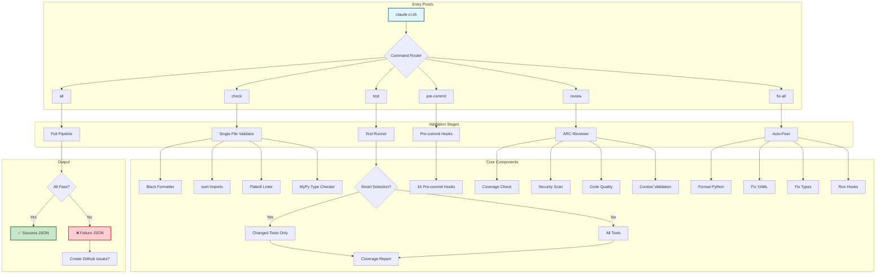
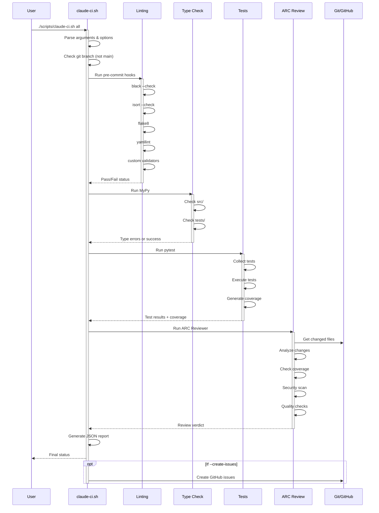
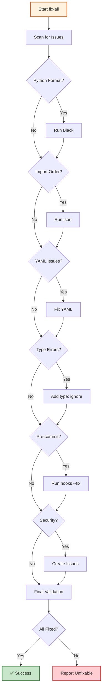
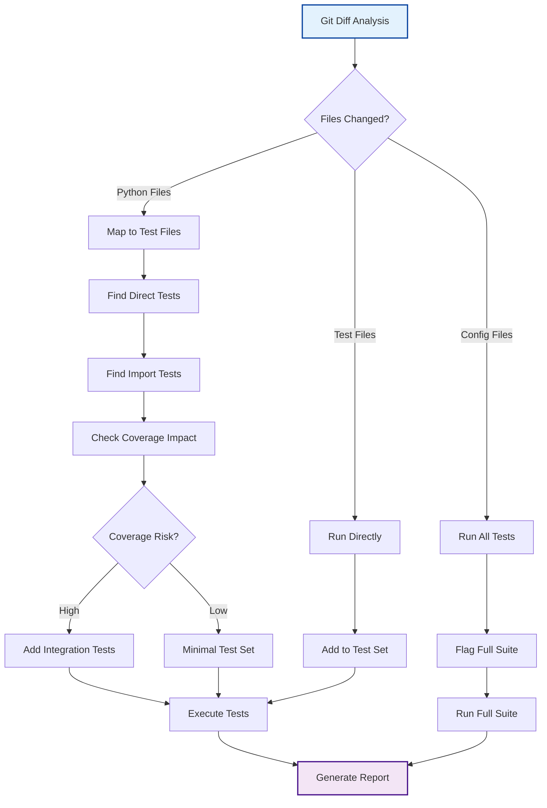
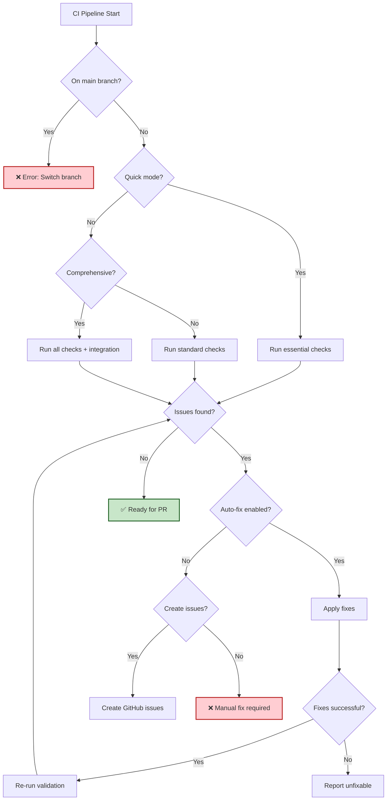
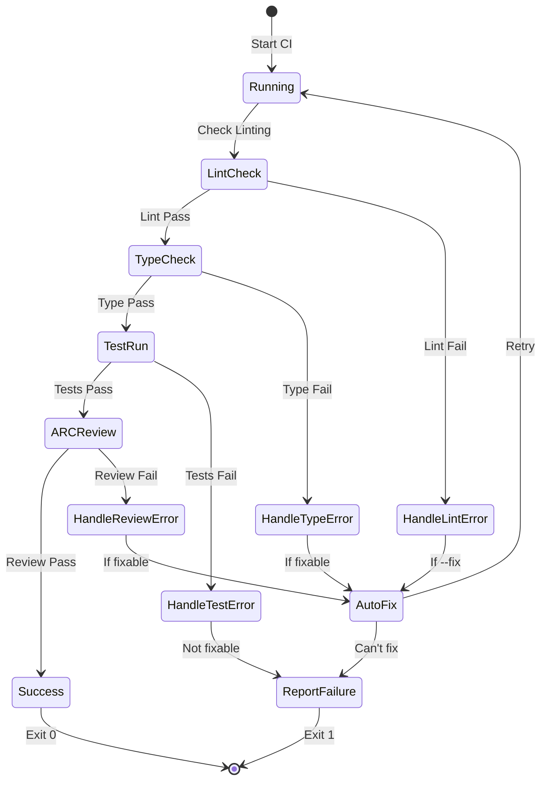
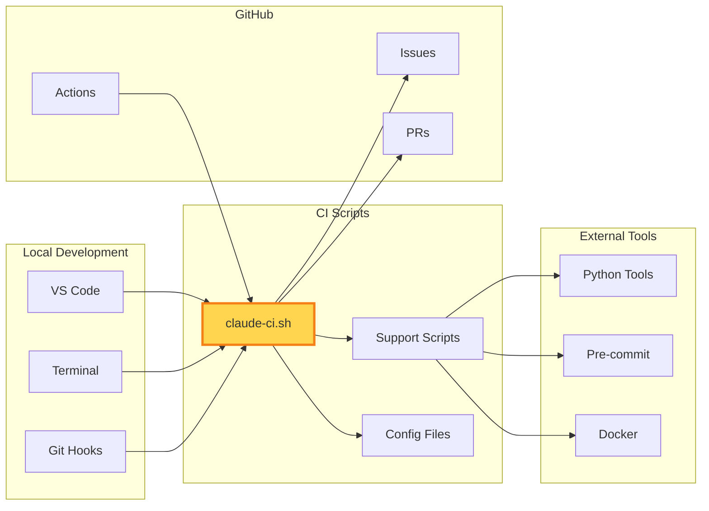
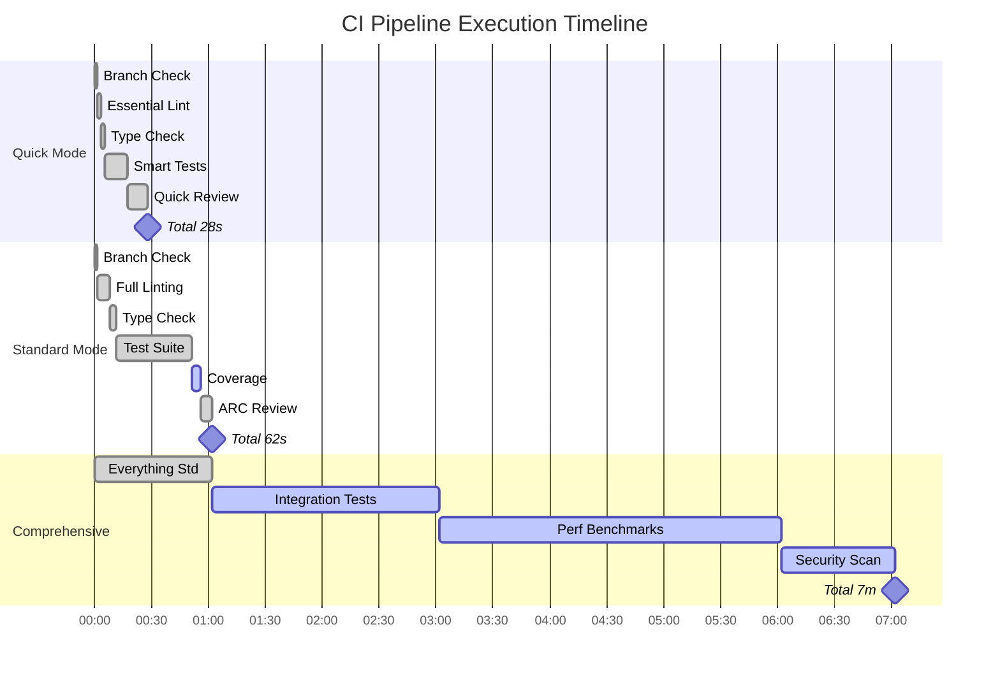

# Claude CI Pipeline Flow Diagrams

Visual representations of the CI pipeline architecture and execution flow.

## Main Pipeline Architecture

## Detailed Execution Flow

## Progressive Validation Strategy

```mermaid
graph LR
    subgraph "Quick Mode (30s)"
        Q1[Essential Checks]
        Q2[Smart Tests]
        Q3[Fast Review]
    end

    subgraph "Standard Mode (3-5m)"
        S1[Full Linting]
        S2[Type Checking]
        S3[Test Suite]
        S4[ARC Review]
    end

    subgraph "Comprehensive Mode (10m+)"
        C1[Everything in Standard]
        C2[Integration Tests]
        C3[Performance Tests]
        C4[Full Coverage Analysis]
        C5[Security Deep Scan]
    end

    Q1 --> Q2 --> Q3
    S1 --> S2 --> S3 --> S4
    C1 --> C2 --> C3 --> C4 --> C5

    Q3 -.->|Escalate if issues| S1
    S4 -.->|Deep dive if needed| C1
```

## Auto-Fix Flow

## Test Selection Strategy

## CI Decision Tree

## Error Handling Flow

## Integration Points

## Performance Optimization

---

*These diagrams represent the actual CI pipeline architecture implemented in the agent-context-template project.*
