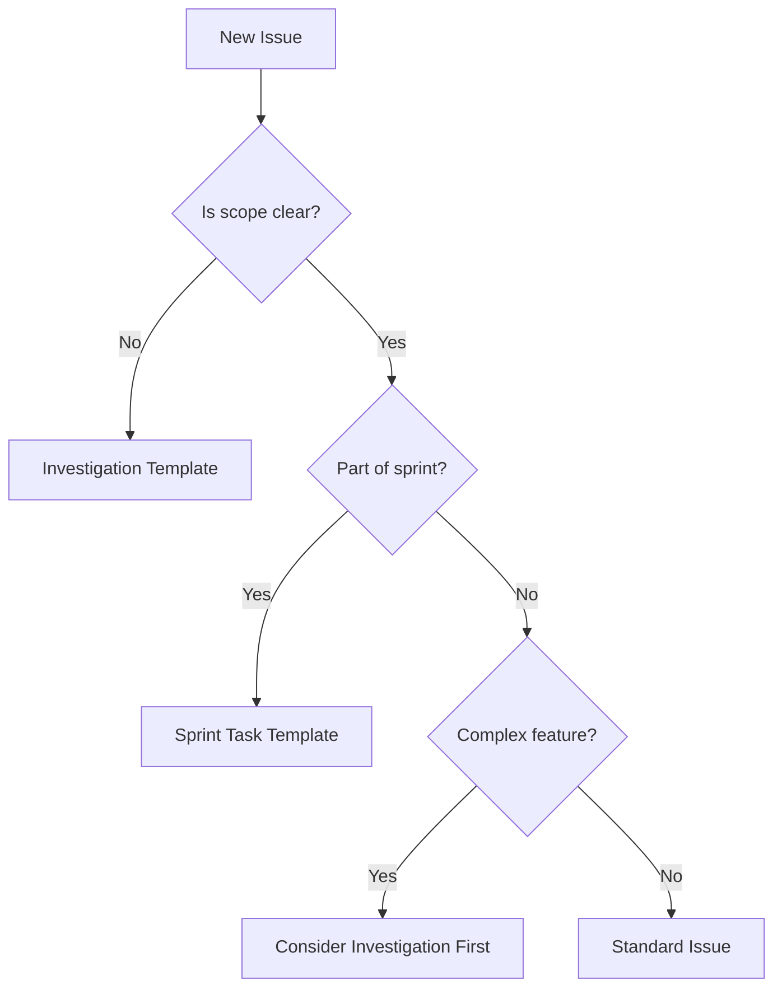

# Issue Writing Guide

## Table of Contents
1. [Introduction: The Hidden Complexity Problem](#introduction-the-hidden-complexity-problem)
2. [Case Study: When a "Simple Fix" Becomes 1300+ Lines](#case-study-when-a-simple-fix-becomes-1300-lines)
3. [The Problem-First Approach](#the-problem-first-approach)
4. [Investigation Issues: When Scope is Unclear](#investigation-issues-when-scope-is-unclear)
5. [Sub-Issue Decomposition Patterns](#sub-issue-decomposition-patterns)
6. [Issue Templates and When to Use Them](#issue-templates-and-when-to-use-them)
7. [Best Practices Checklist](#best-practices-checklist)
8. [Examples: Good vs Poor Issue Writing](#examples-good-vs-poor-issue-writing)

## Introduction: The Hidden Complexity Problem

One of the most common challenges in software development is underestimating the scope of a problem. What appears to be a "simple fix" often reveals layers of interconnected issues that require careful investigation and systematic resolution.

This guide helps you write issues that:
- Accurately describe problems without assuming solutions
- Enable proper scope discovery before implementation
- Support systematic investigation of complex problems
- Facilitate effective decomposition when needed

## Case Study: When a "Simple Fix" Becomes 1300+ Lines

### The Original Issue (#1029)
**Title**: "Fix false positive warnings in pr-conflict-validator.yml"
**Initial Assessment**: A one-line syntax fix in a git command
**Actual Scope**: Three interconnected problems requiring 1300+ lines of changes

### What Happened?
1. **Surface Symptom**: Workflow incorrectly reported PRs as "behind main"
2. **Initial Diagnosis**: Git rev-list command had inverted syntax
3. **Discovery During Implementation**:
   - Problem 1: Git syntax was indeed incorrect
   - Problem 2: Authentication token wasn't accessible at job level
   - Problem 3: API-created checks were appearing in unrelated workflows
4. **Final Resolution**: Three separate PRs merged in sequence

### Key Lesson
The issue description focused on the symptom ("false positive warnings") rather than investigating the root cause. A thorough investigation would have revealed the interconnected problems before implementation began.

## The Problem-First Approach

### Describe What You Observe, Not What You Think the Fix Is

❌ **Poor**: "Fix the typo in line 42 of config.yaml"
✅ **Good**: "Application fails to start with 'invalid configuration' error when using default settings"

❌ **Poor**: "Add null check to user service"
✅ **Good**: "API returns 500 error when accessing /users endpoint without authentication"

### Essential Elements of Problem Description

1. **Observable Symptoms**
   - What exactly happens?
   - When does it happen?
   - How often does it occur?

2. **Reproduction Steps**
   - Environment details
   - Exact steps to reproduce
   - Expected vs actual behavior

3. **Impact Assessment**
   - Who/what is affected?
   - Severity and urgency
   - Workarounds (if any)

4. **Initial Investigation**
   - What you've already tried
   - Relevant logs or error messages
   - Related issues or PRs

## Investigation Issues: When Scope is Unclear

### When to Create an Investigation Issue

Create an investigation issue when:
- The root cause is unclear
- Multiple potential solutions exist
- The problem affects multiple components
- Initial attempts to fix reveal unexpected complexity
- You discover the problem is bigger than originally thought

### Investigation Issue Structure

```markdown
## Symptoms Observed
[Detailed description of what's happening]

## Initial Hypothesis
[Your current understanding, clearly marked as preliminary]

## Investigation Plan
- [ ] Step 1: Check component A for...
- [ ] Step 2: Test theory about...
- [ ] Step 3: Review logs for...

## Findings
[Update this section as you investigate]

## Discovered Sub-Problems
[List any additional issues found during investigation]

## Recommended Next Steps
[Based on investigation findings]
```

### Investigation Workflow

1. **Create Investigation Issue**: Use the investigation template
2. **Time-box Investigation**: Set a reasonable limit (e.g., 2-4 hours)
3. **Document Findings**: Update the issue as you discover information
4. **Decompose if Needed**: Create sub-issues for distinct problems
5. **Close with Summary**: Link to created implementation issues

## Sub-Issue Decomposition Patterns

### When to Decompose

Decompose an issue when:
- Investigation reveals multiple distinct problems
- Different components need different fixes
- Changes must be applied in a specific order
- Different expertise is needed for different parts
- Risk mitigation requires incremental changes

### Decomposition Strategies

#### 1. **Dependency-Based Decomposition**
When fixes must be applied in order:
```
Issue #1: Enable authentication (prerequisite)
Issue #2: Fix core functionality (depends on #1)
Issue #3: Clean up side effects (depends on #2)
```

#### 2. **Component-Based Decomposition**
When different systems need changes:
```
Issue #1: Update frontend validation
Issue #2: Fix backend API endpoint
Issue #3: Update database schema
```

#### 3. **Risk-Based Decomposition**
When changes have different risk levels:
```
Issue #1: Safe refactoring (low risk)
Issue #2: Core algorithm change (medium risk)
Issue #3: Breaking API change (high risk)
```

### Linking Decomposed Issues

Always maintain traceability:
- Reference the original issue in each sub-issue
- Use GitHub's "Relates to #X" syntax
- Create a tracking issue if needed
- Update the original issue with decomposition summary

## Issue Templates and When to Use Them

### Available Templates

1. **Sprint Task Template** (`sprint-task.md`)
   - For planned sprint work
   - Has clear acceptance criteria
   - Includes Claude Code readiness checklist

2. **Investigation Template** (`investigation.md`)
   - For problems with unclear scope
   - Supports systematic discovery
   - Tracks findings and decomposition

3. **Standard Issue** (no template)
   - For straightforward bugs or features
   - When scope is well understood
   - For community-reported issues

### Choosing the Right Template



## Best Practices Checklist

### Before Creating an Issue

- [ ] Search for existing issues
- [ ] Reproduce the problem
- [ ] Gather relevant logs/screenshots
- [ ] Identify affected components
- [ ] Consider investigation needs

### Writing the Issue

- [ ] Use clear, descriptive title
- [ ] Focus on symptoms, not solutions
- [ ] Include reproduction steps
- [ ] Add environment details
- [ ] Specify expected vs actual behavior
- [ ] Include error messages/logs
- [ ] Assess impact and urgency
- [ ] Link related issues/PRs

### After Creating the Issue

- [ ] Add appropriate labels
- [ ] Assign to relevant project/sprint
- [ ] Notify relevant team members
- [ ] Update if new information emerges
- [ ] Close with resolution summary

## Examples: Good vs Poor Issue Writing

### Example 1: Bug Report

❌ **Poor Issue**:
```markdown
Title: Fix user service

The user service is broken. Please fix ASAP.
```

✅ **Good Issue**:
```markdown
Title: User API returns 500 error for valid requests after deployment v2.1.0

## Symptoms
Since deploying v2.1.0 (commit abc123), the GET /api/users/{id} endpoint returns 500 errors for approximately 30% of requests.

## Reproduction Steps
1. Deploy version 2.1.0 to staging environment
2. Make request: `curl https://staging.api/users/12345`
3. Observe 500 error (occurs ~3 out of 10 times)

## Expected Behavior
API should return 200 with user data

## Actual Behavior
Returns 500 with error: "Internal server error"

## Logs
```
ERROR: NullPointerException at UserService.java:142
Stack trace: [attached]
```

## Environment
- Version: 2.1.0
- Environment: Staging
- Load: ~1000 requests/minute

## Initial Investigation
- Problem started after v2.1.0 deployment
- Rollback to v2.0.9 resolves issue
- Appears related to new caching logic
```

### Example 2: Feature Request

❌ **Poor Issue**:
```markdown
Title: Add search

We need search functionality.
```

✅ **Good Issue**:
```markdown
Title: Users unable to find historical transactions beyond 30-day window

## Problem Statement
Users report difficulty locating transactions older than 30 days, as the current transaction list only shows recent items with pagination.

## User Impact
- Support receives ~50 requests/week for help finding old transactions
- Users abandon platform when they can't find payment history
- Compliance requires 7-year transaction history access

## Current Behavior
- Transaction list shows last 30 days
- Pagination available but impractical for old records
- No search or filter options

## Desired Behavior
Users should be able to quickly locate any transaction by:
- Date range
- Amount
- Recipient/sender
- Transaction ID

## Success Criteria
- Find any transaction within 3 clicks
- Search results return within 2 seconds
- Support ticket reduction of 80% for transaction finding

## Constraints
- Must maintain current performance
- Cannot require database migration
- Must work with existing transaction API
```

## Summary

Effective issue writing is about clearly communicating problems, not prescribing solutions. By following these guidelines, you'll help your team:
- Understand the true scope of problems
- Avoid costly scope surprises during implementation
- Make informed decisions about prioritization
- Deliver more predictable results

Remember: A well-written issue saves more time than it takes to write it. When in doubt, investigate first, then implement.
